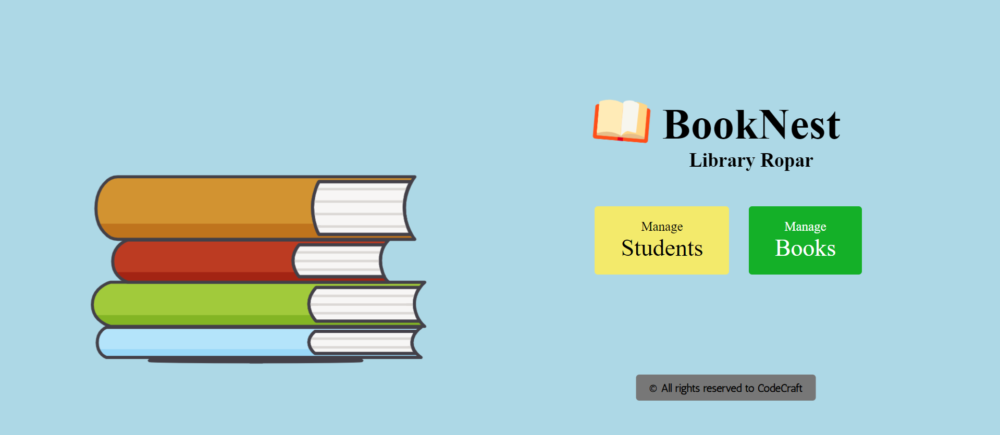
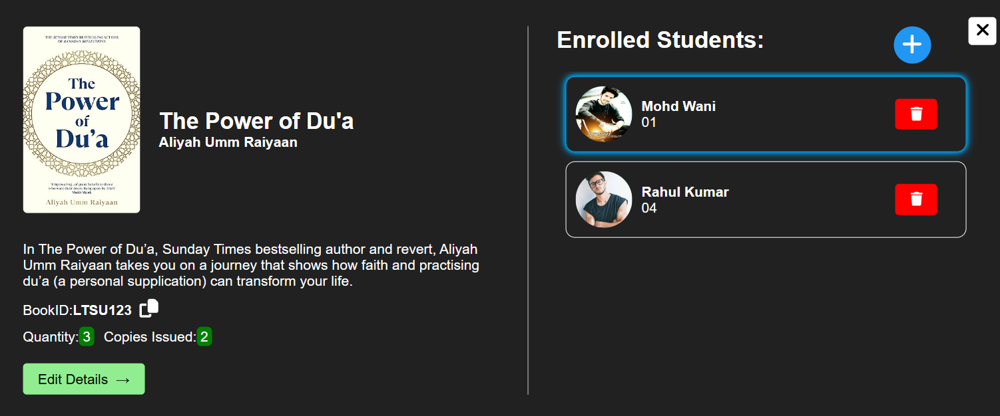
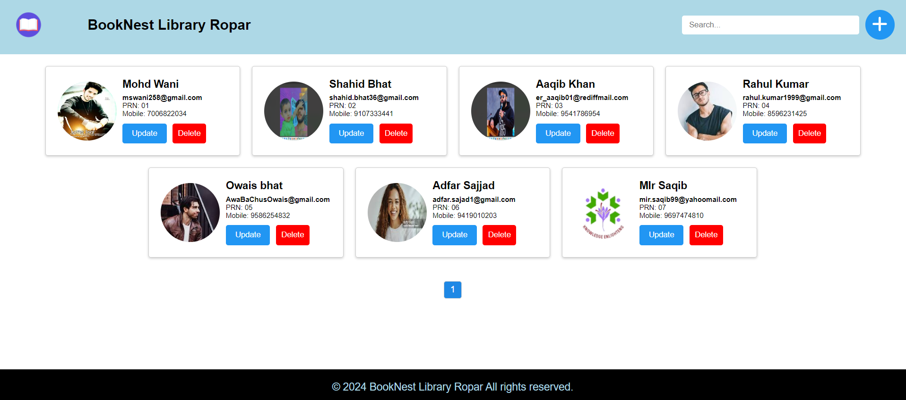
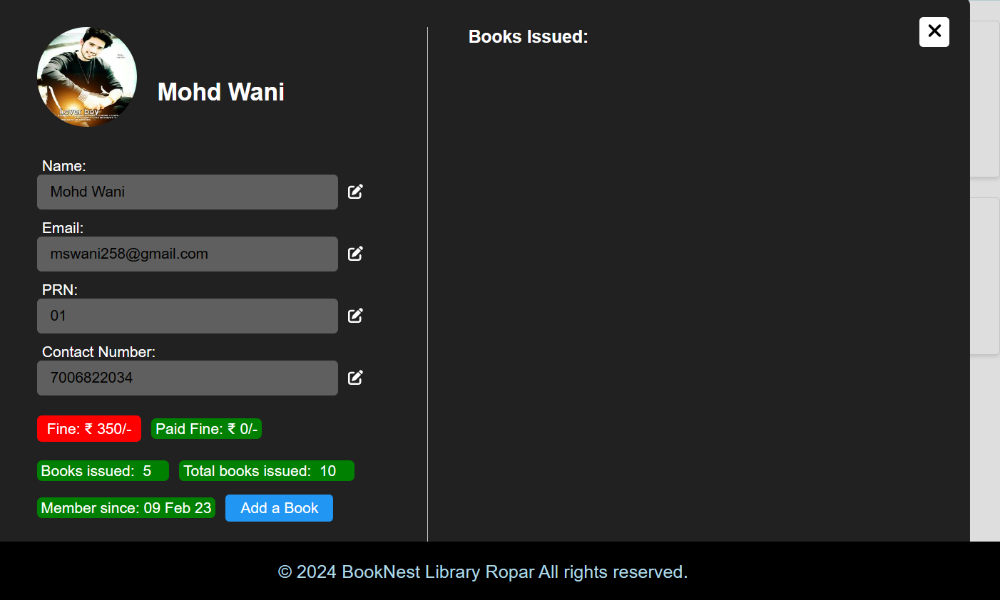

# Library_Management_System-ojt1-

---

# BookNest

Welcome to the BookNest README! BookNest is an exemplary web project developed by Team CodeCraft under the mentorship of play.employability at Lamrin Tech Skills University, Punjab, as a part of the final project of our web development training. BookNest seamlessly combines advanced technologies, superior coding practices, and captivating design aesthetics to build a library management system.

## Visit Website

[BookNest Website](https://booknest.vercel.app/)

## Visit Documentation

[Documentation](#)

## Visit Presentation

[Presentation](#)

## Features

- Implementation of the 5-1 Sass Architecture.
- Utilization of the BEM model for class naming conventions.
- Construction based on Fluid Float Layouts and Flexbox.
- Integration of Responsive units for optimal adaptability.
- Adherence to the principles of color theory in its design, creating visually harmonious and engaging experiences.
- Provision for browsers that do not support specific styles, ensuring a consistent experience across different platforms.
- Built on the NPM ecosystem, leveraging the power of a vast collection of open-source packages and libraries.
- Codebase designed to be reusable, maintainable, and scalable, allowing for easy expansion and updates.
- Meticulously crafted using a Desktop-first approach, ensuring full responsiveness across various devices such as mobile phones, tablets (both in portrait and landscape orientations), and even larger screens.

## Operational Features

### Student Management:

- Add, update, and delete student records.
- Capture essential student details like name, ID number, email, and phone number.
- Persistently store student information in the MongoDB Atlas database.

### Book Management:

- Add, update, and delete book records.
- Include book details such as title, author, description, and code.
- Ensure the secure storage of book information in the MongoDB Atlas database.

### Lending Management:

- Two distinct pages: Student Page and Book Page.
  - **Student Page**:
    - Select a student from a list and manage their borrowed books.
    - Perform actions like selecting, updating, and deleting books for a particular student.
  - **Book Page**:
    - Select a book from a list and manage the student who has borrowed it.
    - Perform actions like selecting, updating, and deleting the student associated with a book.

### Cloudinary and Multer Integration:

- Efficiently handle image-related tasks and upload book covers & student photographs using Cloudinary.
- Utilize Multer for seamless file uploading and management.

### MongoDB Atlas Integration:

- Leverage the power of MongoDB Atlas to persistently store all student, book, and lending data securely.
- Ensure data integrity and availability for reliable library operations.

## Tech Stack

- MongoDB
- Express.js
- React.js (JSX)
- Node.js
- Cloudinary
- Multer
- Vite
- Axios
- Sass
- CSS
- HTML

## API Design

### studentData.js

- **GET API "/studentData"**: To get data of all the students.
- **GET API "/studentData/Available/:id"**: To get data of all the students who have not issued a book of a particular id.
- **POST API "/studentData"**: To post new student data to the database.
- **PATCH API "/studentData"**: To edit student data present in the database.
- **PATCH API "/studentData/BookInfo"**: To edit book data for a particular student.
- **DELETE API "/studentData"**: To delete a student from the database.

### bookData.js

- **GET API "/bookData"**: To get data of all the books.
- **GET API "/bookData/Available/:id"**: To get data of all the books not issued by a student of a particular id.
- **POST API "/bookData"**: To post new book data to the database.
- **PATCH API "/bookData"**: To edit book data present in the database.
- **DELETE API "/bookData/:no"**: To delete a book from the database.

## Production Deployment

- **Frontend**: Vercel, PORT = 5173
- **Backend**: Render, PORT = 3001

For additional information, visit the [website](https://booknest.vercel.app/) • [documentation](#) • [presentation](#).

--- 

Feel free to replace placeholder links (e.g., "#") with actual URLs to provide users with access to your website, documentation, and presentation.

---

# Image Gallery

Welcome to the Image Gallery README! 

## Homepage

Description: The homepage of BookNest Library serves as the entry point to the library
management system, providing users with essential navigation options and a
glimpse of the library's offerings.
The "Students" button directs users to the student management section,
where they can view, add, or edit student information.
The "Books" button navigates users to the book management section,
allowing them to browse, search, and manage the library's collection.

## Image 2

Description: The books available in the library are listed here.

## Image 4

Description: The "Students Section" of BookNest Library provides users with
access to the "Manage Students" page. This page serves as a central hub for
administrators to view, manage, and update details of all registered users
(students) of the library.

## Image 3

Description: Upon accessing the "Manage Section" page, administrators are
presented with a comprehensive list of all registered users of the library.
Each user entry typically includes details such as profile photo, name,
email, contact details, and other relevant information.

## Image 5

Description: Last but not least, the fifth image. Take a moment to appreciate its uniqueness.

---
